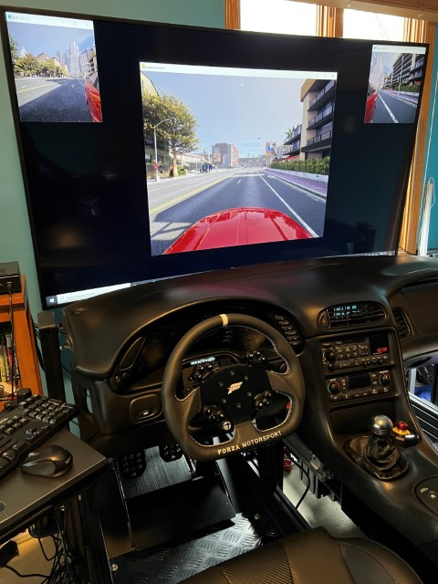

# carla_sim - A Carla Simulator Client

## Xbox One controller, Fanatec DD1 wheels, adjustable rear view mirrors, share memory model between process routines.

## Introduction

This code demonstrates how to share carla data between different python processes via a [shared memory dictionary](https://pypi.org/project/shared-memory-dict/).  

Features
- Supports xbox one controller
- Supports Fanatec DD1 base & Wheels
- Mirror sensor camera images are processed and stored in a shared memory object
- Main simulation thread uses pygame window.
- Share memory is accessed by the mirror view routines and displayed using opencv

---

## Prerequisites

- Download and Install Carla Simualtor 0.9.13 
    - (https://carla.org/)
    - (https://github.com/carla-simulator/carla)
    - (https://github.com/carla-simulator/carla/releases/tag/0.9.13)
- Download and Install AdditionalMaps_0.9.13w
- Install Python 3.8.10
- Install Poetry Dependency Management (https://python-poetry.org/docs/)

## Setup and Execute

- `poetry install` - setup the environment
- Ensure the Carla Simulator is running on localhost and listening to port 2000
  - `.\CarlaUE4.exe -windowed -ResX=1024 -ResY=786 -carla-rpc-port=2000 -quality-level=High`
- Set simulation parameters in `config.yaml`
- `poetry run python sim_main.py` - main simulation thread
- `poetry run python mirror_views.py` - dual mirror views
- `poetry run python right_mirror_view.py` - rigth mirror only
- `poetry run python left_mirror_view.py` - left mirror only

## Utilities

- `poetry run python util_get_joystick_values.py` - Display joystick values untility tool

---

## Controls

### Xbox One Controller

- `Left Stick` - Steering
- `Right Trigger` - Accelerate
- `Left Trigger` - Brake
- `A` - Toggle Reverse
- `B` - Hand Brake

### Fanatec DD1 Wheel Controller

- `Wheel` - Steering
- `Accelerator Pedal` - Accelerate
- `Brake Pedal` - Brake
- `A` - Toggle Reverse
- `B` - Hand Brake

---

## Mirror Adjustment Keys

### Left Mirror Controls

- `W` - Left Mirror Rotate Up
- `X` - Left Mirror Rotate Down
- `A` - Left Mirror Rotate away from car
- `B` - Left Mirror Rotate towards car

### Right Mirror Controls

- `T` - Right Mirror Rotate Up
- `B` - Right Mirror Rotate Down
- `H` - Right Mirror Rotate away from car
- `F` - Right Mirror Rotate towards car

---

## Screenshot

